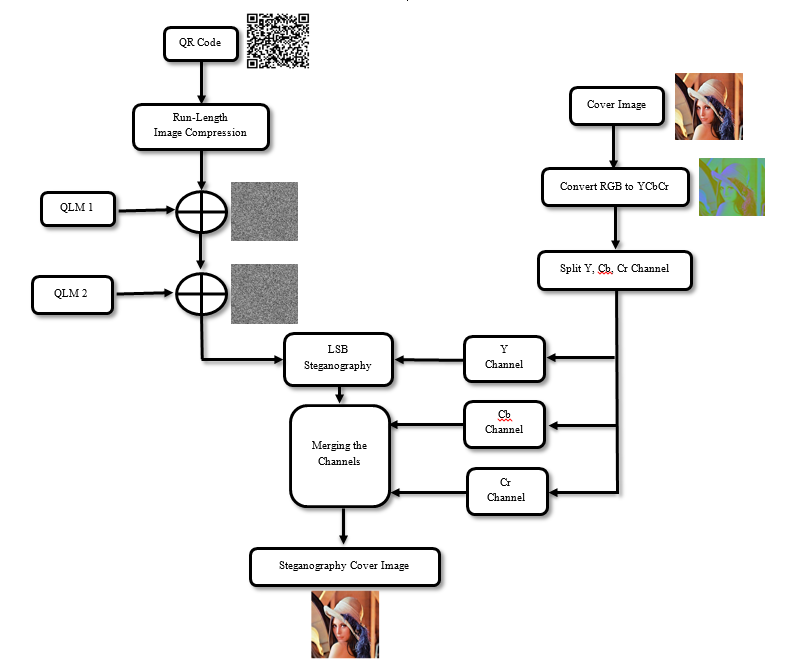
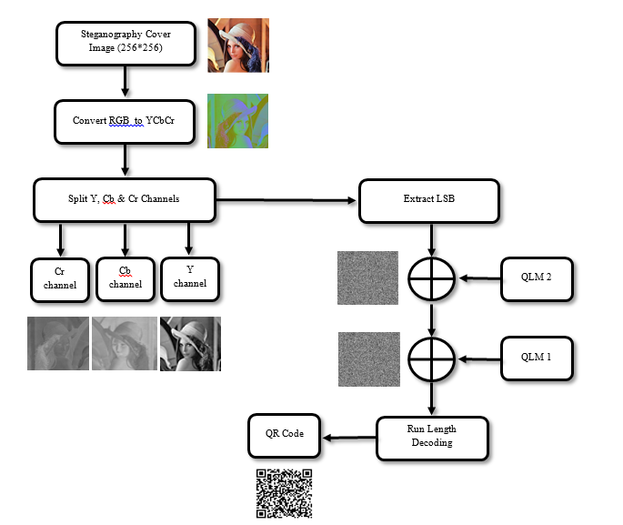

# 🔑CampusKey

CampusKey is a robust digital identity verification system that securely embeds user-specific QR codes into ID card images using advanced LSB steganography and 5D Quantum Logistic Map encryption. Designed primarily for educational institutions, it ensures tamper-resistant and invisible ID encoding, with real-time database verification support.

## 🧠 Overview
This project aims to enhance the security of digital ID cards using a multi-layered approach:
Invisible QR code embedding via LSB Steganography in the Y channel of YCbCr color space
Chaotic encryption using a 5D Quantum Logistic Map
Real-time verification of extracted QR codes against a database

## 🔧 Technologies Used
Technology	Purpose
Python	Core programming language
OpenCV	Image manipulation & QR scanning
Pillow	Image I/O operations
NumPy, SciPy	Data processing and transformations
QR Code Libraries	QR code generation & decoding
Flask/Django (optional)	For web-based verification interface
SQL/NoSQL DB	User and ID record storage
Git	Version control

## 🚀 Features
🔒 Encrypted QR Embedding using chaotic maps (5D QLM)
🖼️ Imperceptible Steganography in the Y channel of YCbCr
🗃️ Database Verification of extracted IDs
📉 Compression via RLE before encryption
⚙️ Robust Extraction despite compression/noise
📲 Future Mobile App & Blockchain Support

## 🛠️ Installation & Setup

```bash
# Clone the repository
git clone https://github.com/Samyakjain2004/CampusKey.git
cd CampusKey

# Install dependencies
pip install -r requirements.txt

```

Dependencies include:
- opencv-python
- pyzbar
- pillow
- numpy
- flask or django (optional for web support)

## 📌 How It Works

### 🔐 Embedding Flow:
- Generate unique QR Code from user ID.
- Convert QR to binary → compress using Run Length Encoding.
- Encrypt with 5D Quantum Logistic Map.
- Convert target image to YCbCr → Embed into LSBs of Y channel.
- Reconstruct and save the final stego image.

### 🔓 Extraction Flow:
- Convert stego image to YCbCr.
- Extract LSBs from Y → Decrypt using QLM → Decompress.
- Reconstruct QR Code → Scan → Verify against database.

## 🗂️ Project Structure

```bash
CampusKey/
├── FQLM1.py           # First phase of chaotic encryption using 5D QLM
├── FQLM2.py           # Second phase of chaotic encryption using 5D QLM
├── FYCBCRDec.py       # Converts stego image to YCbCr and extracts LSBs
├── FYCBCREnc.py       # Embeds encrypted data into Y channel of YCbCr
├── Frleencode.py      # Run-Length Encodes the QR binary
├── Frledecode.py      # Decodes the RLE-compressed bitstream
├── XOR1.py            # XOR encryption with QLM1 output
├── XOR2.py            # XOR encryption with QLM2 output
├── cover_image.png    # Base image used to hide QR code
├── qr code.jpg        # Sample QR code image (to be embedded)
├── encryption_flow.png    # Flow chart to show complete encryption
├── decryption_flow.png    # Flow chart to show complete decryption
└── README.md

```

### 🔐 Encryption Flow

```bash
[qr code.jpg]
    ↓
[Frleencode.py] → Run-Length Encoding of QR binary
    ↓
[FQLM1.py] + [XOR1.py] → First layer of chaotic encryption
    ↓
[FQLM2.py] + [XOR2.py] → Second layer of chaotic encryption
    ↓
[FYCBCREnc.py] → Embed into Y channel using LSB in cover_image.png

```

### 🔓 Decryption Flow

```bash
[Stego Image]
    ↓
[FYCBCRDec.py] → Extract LSBs from Y channel
    ↓
[XOR2.py] + [FQLM2.py] → Reverse second XOR
    ↓
[XOR1.py] + [FQLM1.py] → Reverse first XOR
    ↓
[Frledecode.py] → Run-Length Decode
    ↓
[Reconstruct QR] → Scan and verify


```

## 📊 Flowchart Diagrams

### Encryption Flow


### Decryption Flow



## 🌱 Future Scope
- 🔍 AI-based tamper detection
- 🔗 Blockchain-based ID verification
- 📱 Cross-platform mobile app
- 🧠 Biometric fusion (face/fingerprint)
- 🚪 IoT integration for access control

## 📜 License

This project is licensed under the MIT License.

## 👨‍💻 Author

Samyak Jain
🔗 LinkedIn - https://www.linkedin.com/in/samyak-jain-470b7b255

🔗 GitHub - https://github.com/Samyakjain2004

## 🤝 Contributing
Pull requests and suggestions are welcome! For major changes, please open an issue first to discuss.


